# 助农东西山微信小程序系统设计与实现

## 摘 要


中国作为农业大国，正面临从传统农业向现代农业转型的压力，消费者对食品安全和品质的要求也在日益提高。在"互联网+"战略的推动下，微信小程序作为新兴的电子商务模式，为农产品销售提供了新的机遇。国内外农产品电商的发展现状显示，电子商务已成为推动农业现代化和农民增收的重要途径。为此，本文设计了一个助农东西山微信小程序，旨在通过线上线下相结合的销售模式，提升农产品流通效率，增加农民收入，并满足城市居民对优质农产品的需求。

本文首先介绍了开发本系统需要用到的技术，主要分析了微信小程序端相关技术，包括微信小程序的基本概念、开发环境（微信开发者工具）、原生技术（如WXML、WXSS、JavaScript等）。接着对系统进行了全面的需求分析，从技术、经济和操作三个角度评估了系统的可行性，并详细描述了系统的功能性需求和非功能性需求。在需求分析的基础上对系统进行了总体设计，概述了系统设计的原则、总体架构以及核心功能模块的设计，并详细阐述了数据库的概念设计、逻辑设计和表设计。在后端实现中，系统采用了SpringBoot和Mybatis框架，确保了系统的稳定性、可扩展性和可维护性，并且基于该框架，以农产品购买和搜索模块为例，展示了系统的具体实现过程，包括关键代码片段和实现逻辑。最后对系统进行了功能性测试，确保系统能够实现农产品的全面展示、在线浏览、购买以及搜索等核心功能，并且运行稳定，满足用户需求。

**关键词：**农产品；微信小程序；电商；SpringBoot框架


# Design and implementation of wechat mini program system forNongdongshan

## ABSTRACT

As a big agricultural country, China is facing the pressure of transforming from traditional agriculture to modern agriculture, and consumers' requirements for food safety and quality are also increasing. Driven by the "Internet +" strategy, WeChat applets, as a new e-commerce mode, provide new opportunities for agricultural products sales. The development of e-commerce for agricultural products at home and abroad shows that e-commerce has become an important way to promote agricultural modernization and increase farmers' income. For this reason, this thesis designs a small program of WeChat for helping farmers, which aims to improve the circulation efficiency of agricultural products, increase farmers' income and meet the demand of urban residents for high-quality agricultural products through online and offline sales mode.

This thesis first introduces the technology needed to develop this system, and mainly analyzes the related technologies of WeChat applet, including the basic concept of WeChat applet, development environment (WeChat developer tool), native technology (such as WXML, WXSS, JavaScript, etc.). Then the system is analyzed comprehensively, and the feasibility of the system is evaluated from three aspects of technology, economy and operation, and the functional and non-functional requirements of the system are described in detail. On the basis of requirement analysis, the overall design of the system is carried out, the design principle, overall structure and the design of the core function module of the system are summarized, and the concept design, logic design and table design of the database are elaborated in detail. In the back-end implementation, the system adopts SpringBoot and Mybatis framework to ensure the stability, extensibility and maintainability of the system. Based on the framework, taking the agricultural product purchase and search module as an example, the concrete implementation process of the system is shown, including key code fragments and implementation logic. Finally, the functional test of the system is carried out to ensure that the system can realize the core functions of comprehensive display, online browsing, purchasing and searching of agricultural products, and runs stably to meet the needs of users.

**Keywords:**agricultural products; WeChat applet; e-commerce; SpringBoot framework


# 目   录

```{=openxml}
<w:p>
  <w:pPr>
    <w:pStyle w:val="Normal"/> 
    <w:jc w:val="left"/>
  </w:pPr>
  <w:r>
    <w:fldChar w:fldCharType="begin"/>
  </w:r>
  <w:r>
    <w:instrText xml:space="preserve"> TOC \o "1-3"  \z \u </w:instrText>
  </w:r>
  <w:r>
    <w:fldChar w:fldCharType="separate"/>
  </w:r>
  <w:r>
    <w:fldChar w:fldCharType="end"/>
  </w:r>
</w:p>
```


```{=openxml}
<w:p>
  <w:pPr>
    <w:sectPr>
      <w:type w:val="nextPage"/>
    </w:sectPr>
  </w:pPr>
</w:p>
```


# **第1章 绪论**

## **第1.1节 选题背景及意义**

中国是一个农业大国，在农业生产和农产品销售方面具有独特的性质和背景。随着中国社会经济的快速发展，农业正面临着从传统模式向现代化、集约化、智能化转型的压力。此外，中国农产品市场的分散性和多样性，也给农产品销售带来了诸多挑战。同时，消费者对食品安全、健康和品质的要求不断提高，对农产品的选择和购买也更加理性和多元化。在这种情况下，互联网技术的发展为农产品销售提供了新的机会，微信小程序作为一种新兴的电子商务模式，因其高效连接消费者和生产者的特性能够更好地解决传统销售模式所面临的问题。通过微信小程序的数字化平台，农产品销售可以更加方便、高效、透明，消费者可以直接获得农产品的信息，保障食品安全，同时也能够更好地促进农产品的品牌化和标准化，让更多的优质农产品走向市场，助力中国农业现代化和农村振兴。

列表锚点

1.  灵活的配置选项，允许开发者像点菜一样选择、组装并生成一个独立的开发初始项目。

2.  内置Tomcat服务器和Jetty服务器，项目可以被直接打包成JAR文件，这种设计特别适用于Docker等容器化环境。

3.  通过创新starter POMs的配置方式，大幅度简化了Maven的配置过程；

4.  为大中型项目提供了丰富的非业务功能特性，如健康状态监测、外部配置管理、性能指标监控和安全机制等[@zhang2017springboot]。

- 呜呜呜呜呜呜呜呜呜
- wwwwwwwwww
- 呜呜呜呜呜呜呜呜

- 就开了极乐空间了解

1. 撒大健康拉数据 
2. 时间到了卡视角
3. 撒娇达克拉四级联考

1.手动滑稽拉开始
2.撒带回来卡萨丁
3.啊实践活动哪里看撒记得考拉


随着"互联网+"战略的深入实施，微信小程序的应用与推广在助农领域显得尤为关键，能够推动传统农业与现代信息技术的深度融合，帮助构建农产品电子商务生态系统，实现数据驱动的精准营销和动态管理。这种模式的成功实施和普及，能够激活农村经济，促进就业，助力农民增收，促进农村地区的数字化建设，也有助于缩小城乡经济差距和贫富差距，实现更加公平、可持续的经济发展。

## **第1.2节 国内外发展现状**

### **1.2.1 国外研究现状**

全球范围内，互联网的普及极大地推动了农业电子商务的发展，尤其在欧美和亚洲的发达国家中效果显著。美国拥有众多农业相关网站和数据库，使得超半数的农产品可以通过互联网销售。英国自1996年便建立了农业产品信息网站，至2014年，大部分农场已经在Farmer\'s
Market上注册。日本则发展了集成批发市场、产量和价格预测等功能的农业电商系统，帮助生产者掌握市场动态，同时消费者通过平台如乐天市场进行购买。韩国的Kgfarm平台为农户和企业提供在线销售服务，此外还运营着大型的B2B电子交易所[@shen2020nongchanpin]。随着电子商务的兴起，农产品电商在美国、日本、英国等国受到高度重视，并进行了相关研究和规范。例如，FreshDirect等大型交易平台主导了西方国家的农产品电子商务模式，通过O2O平台实现了从田间到餐桌的直接供应链[@ge2022yiqing]。Wen在2007年的研究中不仅探讨了农产品在线销售的不同模式，还构建了一个新型的电子商务系统模型[@wen2007knowledge]，而Poole在2001年的研究中系统性分析了农产品在线交易的基础问题，强调了农业电子商务在促进信息流通以及改善市场产业结构和价格透明度方面的作用[@poole2001agricultural]。这些研究和实践表明，农业电子商务对全球农产品市场具有深远的影响。

### **1.2.2 国内研究现状**

我国的农产品电子商务平台发展迅速，已成为连接农民与市场的关键桥梁，提供了从在线支付到物流配送的一站式服务，显著提升了销售便捷性和效率。随着供应链的完善，平台如淘宝和京东推动农产品直销，减少中间环节，从而降低成本、增加农民收益，并扩展消费者选择[@luo2017xiayang]。技术进步的显著体现包括了B/S架构、PHP、MySQL、J2EE、ASP.NET、JAVA、JavaScript、AJAX、HTML5、jQuery和Node.js等技术的有效应用，这些技术的应用不仅极大地丰富了平台的功能性，而且在信息管理、即时通讯、系统安全和网站优化等方面发挥了关键作用[@he2019html5]。在这样的技术推动下，一些新的平台模式也应运而生，以"指上农庄"等微信小程序为代表的农产品交易平台依托微信的用户基础和社交网络特性为农产品销售提供新动力，其用户友好性和社交功能整合推动了农产品流通和农民收入提升[@chao2023zhishang]。然而，农民还面临低效流通、信息不对称、非标准化产品和薄弱的农村互联网环境等挑战。解决这些问题需要改善物流、增强信息透明度、提高产品标准和农民互联网知识，并加强政策支持与平台专业化[@fan2018youji]。同时，销售平台还需提升信息化管理、优化批发市场效率，解决系统功能单一、用户体验差和缺乏专业数据服务等问题，克服管理体制和传统交易习惯所带来的挑战[@zhang2019haijixing]。

## **第1.3节 课题主要内容**

本文研究的助农东西山微信小程序专注于为苏州东西山地区提供线上线下相结合的农产品销售服务，旨在促进农产品流通，拓宽销售渠道，提升农民收入，满足城市居民对优质农产品的需求。主要开发微信小程序客户端页面，通过调用后端API接口实现农产品展示、浏览、购买和搜索等功能。利用IDEA开发后端服务器，支持小程序页面功能。旨在为用户提供便捷、直观、功能丰富的农产品购物平台，推动农产品线上销售，助力农村电商发展。

## **第1.4节 论文组织结构**

根据上述的工作内容，将本文分为七个部分，详细介绍助农东西山微信小程序的逐步形成，本文的组织结构如下：

第一章：绪论。本章的主要内容：关于课题的研究背景及意义、系统的国内外研究现状、本文的工作内容以及本文的组织结构。

第二章：系统的相关技术。主要介绍使用的开发工具、系统的框架以及数据库。

第三章：对系统的需求分析。重点介绍功能性需求，通过用例图介绍系统的基本功能。

第四章：系统的设计。主要介绍系统的框架搭建、系统功能设计、模块功能的详细设计以及数据库设计。

第五章：系统的实现。主要介绍系统的核心模块的实现，展现核心功能模块实现代码。

第六章：系统的测试。主要对系统的核心模块进行测试和展示效果。

第七章：总结与展望。分析总结出不足之处以及展望今后能够完善不足。

## 第1.5节 本章小结

本章介绍了选题背景及意义，国内外的研究现状，并对本文的工作内容进行总结，最后介绍了本文的组织结构。

# **第2章 相关技术**

## **第2.1节 微信小程序端相关技术**

### **2.1.1 微信小程序**

微信小程序通过即用即走、无需下载安装的特点，提供了极致便捷的使用体验，节省用户时间和操作成本，并以快速响应和云端存储优势提升了用户满意度。在开发和推广方面微信小程序也具有显著优势。相较于APP，小程序开发成本更低，开发周期更短，且支持一套代码多端使用，极大地提高了开发效率。此外，小程序拥有众多开放入口，可以通过多种方式与用户互动和推广，如扫码、分享、搜索等，为开发者提供了更多元化的推广渠道。同时，小程序发布只需向微信公众平台提交审核，简化了产品发布流程，降低了运营成本[@wang2018weixin]。在数据安全和隐私保护方面微信小程序也有着严格的监管和审核机制，为用户和开发者提供了便捷、高效的服务和体验，展现了巨大的发展潜力。

### **2.1.2 微信开发者工具**

在开发微信小程序的过程中，开发者主要依赖腾讯官方推出的微信Web开发者工具。这款工具不仅支持小程序的API和页面开发调试，还涵盖了代码查看、编辑、小程序预览以及发布等一体化服务。它使用JavaScript编写逻辑代码，通过WXML描述页面结构，以及WXSS定义节点样式。由于小程序独特的渲染与逻辑处理机制，微信Web开发者工具的高效功能对于确保小程序功能的完善与稳定至关重要。底层框架基于Node.js、chromium及系统API等技术构建，同时融合了React、Redux等前端技术框架，提升了开发效率和用户交互体验，实现了代码跨平台使用的目标，为开发者提供了灵活便捷的开发体验。

### **2.1.3 微信小程序原生框架**

微信小程序原生框架的开发依赖于微信官方提供的开发工具和原生语法，无需引入第三方框架。其核心开发工具------微信开发者工具，集成了从编辑、预览、调试到发布的完整功能链，极大地提高了开发效率。小程序使用JavaScript、WXML（类似HTML）和WXSS（类似CSS）作为主要开发语言，并采用组件化开发方式，通过提高代码的可维护性和复用性来降低维护成本。数据绑定和事件处理作为原生框架的关键特性，让页面能够动态更新并响应用户交互，从而为用户提供丰富的体验。此外，微信小程序原生框架还提供了丰富的API接口和功能扩展能力，如页面导航、网络请求和数据存储等，开发者可根据需求选择扩展方式，如利用云开发技术，以进一步提升小程序的功能和性能。

## **第2.2节 前端相关技术**

Web前端开发的核心技术包括HTML5、CSS3和JavaScript。HTML5，作为前端开发的基础，提供了丰富的标签来定义网页结构和内容，支持多媒体播放、表单增强和页面可访问性，具有低成本开发、简化代码、跨平台支持等优势，是构建现代网页应用的强大工具[@jiang2019html5css3]。CSS3则定义了如何显示HTML元素，通过控制网页的外观如字体、颜色、布局等，实现内容与样式的分离，提高了代码的可维护性和复用性，并支持多种媒体类型的渲染[@chen2018html5development]。JavaScript则是前端交互的核心，它不仅能够实现网页上的各种交互效果，如轮播图、表单验证等，还能够与服务器进行通信，实现数据的动态加载和处理，从而优化Web开发的整体水平，提升用户体验[@wang2022javascript]。

在微信小程序开发中，微信平台引入了WXML和WXSS两大技术，分别类似于HTML和CSS，用于构建小程序的页面结构和描述组件样式，支持数据绑定、列表渲染等功能，为小程序开发提供了高效且交互性强的解决方案。

## **第2.3节 后端相关技术**

### **2.3.1 SpringBoot框架**

SpringBoot是由Pivotal团队2013年提供的在avaEE编程领域一个全新的轻量级框架。是基于Sping的4.0版本设计的，继承了原有Sping框架的优秀基因，为简化Spring项目配置，能轻松地创建独立的、可生产的、基于Spring的且能直接运行的应用程序[@lv2018springboot]。

Spring
Boot技术的显著优势体现在其独特的配置方式，这种方式简化了Spring应用各方面的配置流程。Spring
Boot还能够集成大量的框架，从而有效解决了过去项目间包版本依赖和稳定性方面的关键问题。

Spring Boot的特点包括：

1.  灵活的配置选项，允许开发者像点菜一样选择、组装并生成一个独立的开发初始项目。

2.  内置Tomcat服务器和Jetty服务器，项目可以被直接打包成JAR文件，这种设计特别适用于Docker等容器化环境。

3.  通过创新starter POMs的配置方式，大幅度简化了Maven的配置过程；

4.  为大中型项目提供了丰富的非业务功能特性，如健康状态监测、外部配置管理、性能指标监控和安全机制等[@zhang2017springboot]。

### **2.3.2 Mybatis框架**

MyBatis是一个出色的数据持久层框架，具有高度可定制化的特性，支持用户自定义SQL语句和存储过程。它巧妙地封装了JDBC，简化了数据库操作，通过配置文件实现了数据库信息与Java对象的映射，提升了系统性能[@lei2019xiaoyuan]。

相较于其他ORM工具，MyBatis作为一种ORM框架，在执行SQL时，显著提升了输入输出数据的管理便捷性。核心优势体现在能够轻松地执行SQL语句，并高效地将结果映射至相应对象。经过深入比较分析，MyBatis的主要优点可以概括如下：

（1）灵活支持SQL查询语言：MyBatis允许直接编写SQL，确保了查询语句的灵活性和精确性。

（2）全面的SQL操作支持：MyBatis使用SQL编写查询和更新语句，确保了数据库操作的直观性和高效性。。

（3）无外部依赖的独立性：MyBatis不依赖于特定的数据库系统或外部库，增强了系统的可移植性和稳定性。

（4）高效处理海量数据：MyBatis提供高效的映射和处理机制，确保了对大规模数据集的快速处理[@li2016springmvc]。

### **2.3.3 MySQL数据库**

MySQL是一种广泛应用且功能强大的关系型数据库技术，具备数据存储、管理及共享的核心功能。其强大的特性体现在系统管理工具、查询优化器、SQL接口、连接池、解析器、查询缓存、存储引擎和文件系统等方面。此外，MySQL还具备防止死锁和日志事务支持的能力，为系统开发提供有力支撑[@zhang2021j2ee]。MySQL数据库的优点主要体现在以下几个方面：

（1）功能全面：MySQL包含系统管理控制工具、查询优化器、SQL接口等，满足复杂业务需求，实现高效数据管理。

（2）性能卓越：采用高效查询优化技术和多线程访问，确保快速响应和正确执行，满足大规模数据处理。

（3）易用性佳：简洁直观的界面和友好操作方式，使新手也能快速上手并进行数据库管理。

（4）成本低廉：免费开源，降低中小型企业和个人开发者的成本。

（5）安全可靠：多种安全措施保护数据安全，具备容错和恢复能力，确保业务连续性。

（6）扩展灵活：支持多种存储引擎选择，提供丰富内置函数和扩展接口，方便自定义开发和集成。

## **第2.4节 本章小结**

本章重点介绍了系统采用的主要框架和关键技术。前端利用微信小程序及其原生框架，结合前端框架和JavaScript编程，确保了良好的用户体验；后端依托Spring
Boot和MyBatis框架构建了稳定可靠的服务层，利用MySQL数据库实现高效的数据存储与查询；微信开发者工具贯穿整个开发流程，为系统的稳定运行和优质体验提供了有力保障。


# **第3章 系统需求分析**

第3.1节 系统可行性分析

在进行系统设计和开发之前，对其进行可行性分析是至关重要的。可行性分析不仅能够帮助我们全面评估系统的技术实现难度、经济成本效益以及社会影响等因素，还能为后续的系统设计和开发提供重要的决策依据。因此，本小节将重点介绍技术可行性、经济可行性以及操作可行性。

### **3.1.1 技术可行性**

使用微信开发者工具、IDEA、Spring
Boot框架和MySQL数据库开发微信小程序，从技术角度看是可行的。这些工具和技术在业界应用广泛，性能稳定，能够确保小程序的开发效率和质量。同时，它们提供了丰富的功能和良好的开发体验，使开发者能够专注于业务逻辑的实现，降低了技术实现的难度。

### **3.1.2 经济可行性**

从经济角度看，Spring
Boot和MySQL的开源特性降低了开发成本，而微信开发者工具和IDEA的免费版已经能够满足基本开发需求。此外，该微信小程序具有广阔的市场前景和盈利潜力，通过合理的商业模式和运营策略，可以实现良好的经济回报。

### **3.1.3 操作可行性**

在操作层面，开发本系统所使用的工具和技术提供了直观的用户界面和友好的操作体验，界面设计简洁明了，操作流程简化，提供清晰的指示和反馈，确保开发者和用户能够轻松上手并流畅使用。同时，它们也保证了系统的稳定性和可靠性，降低了维护和管理的难度。

## 第3.2节 系统需求概述

通过对市场上同类型小程序的调研与分析，我发现尽管小程序在农产品销售领域的应用已较为广泛，但针对特定区域的助农小程序仍存在一定的发展空间。尤其是在提升用户体验、优化功能布局、加强品牌宣传等方面，有着较大的改进和提升空间。因此，我设计了一款针对苏州东西山地区的助农微信小程序。该小程序将充分利用微信小程序的优势，结合苏州东西山的地域特色和产品特点，为当地农户和消费者提供一个高效、便捷的农产品销售和推广平台。

## 第3.3节 功能性需求分析

经过对同类型助农微信小程序的深入研究，分析出系统应该具备的基本功能，现将对本系统的基本功能进行逐一阐述。

1.  微信授权登录：用户在进行购买或查看个人信息时，系统引导用户进行微信授权登录，获取必要的用户信息。

2.  农产品展示：小程序展示苏州东西山地区的优质农产品，包括详细信息如图片、价格、产地、规格等，方便用户选择。

3.  购物车功能：用户可以将心仪的农产品加入购物车，进行数量调整和全选操作，快速结算并完成支付，支付完成后购物车自动清空。

4.  订单管理：用户在下单后可以在小程序内我的-我的订单模块查看订单状态。

5.  商城搜索：用户在搜索栏输入农产品名称后，系统展示与关键词匹配的农产品，用户点击可快速跳转至详情页面获取更多信息。

6.  农产品认养：提供从产品展示到购买支付、订单生成及生长反馈的一站式体验，确保流程透明便捷，满足用户对健康、安全农产品的需求。


## **第3.4节 非功能性需求分析**

### **3.4.1 性能需求分析**

系统需要确保高效的性能表现和稳定的运行状态。即快速响应用户操作、快速加载页面内容，以及在高并发场景下保持服务的可用性和稳定性。同时，小程序应具备故障恢复能力，能够在出现故障时迅速恢复服务，确保用户体验的连贯性和满意度。

### **3.4.2 安全性需求分析**

需要高度重视用户数据的安全性和隐私保护。即采取加密措施保护用户信息的传输和存储，防止数据泄露或被非法获取。本系统采用的时MySQL数据库，可以保证数据的安全。对于涉及支付功能的小程序，还需确保交易过程的安全性，防止欺诈行为和资金损失。

### **3.4.3 易用性与可维护性需求分析**

应提供简洁明了的界面设计和流畅便捷的操作流程，以降低用户的学习成本和提高使用效率。同时，小程序应具备良好的可维护性，便于开发人员对代码进行后续的修改、升级和维护工作。

## **第3.5节 用例描述与分析**

### 3.5.1 典型用例描述

下面将举例列举几个关于助农东西山微信小程序相关用例来描述该微信小程序应该满足什么样的功能。

助农东西山微信小程序的部分用例事件如下：

（一）用例名名称：微信授权登录

用例描述：用户在使用小程序时，需通过微信授权登录，以便系统获取用户的基本信息，确保购买或认养等操作的顺利进行。

参与者：用户、微信小程序

前置条件：用户访问小程序进入我的页面或尝试进行购买或认养操作。

基本路径：

(1) 用户点击购买或认养按钮。

(2) 系统提示用户登录，并跳转至我的页面进行微信授权。

(3) 用户确认授权，小程序获取微信基本信息。

(4) 授权成功，用户可继续购买或认养农产品。

（二）用例名名称：购物车功能

用例描述：用户在购物车中添加、修改农产品，并生成订单进行购买。

参与者：用户、微信小程序

前置条件：用户已成功登录小程序，在商品详情页将商品加入购物车。

基本路径：

(1) 用户将农产品加入购物车。

(2) 系统更新购物车列表，显示已选农产品及数量。

(3) 用户对购物车内的农产品进行全选、增减数量等操作。

(4) 用户确认购买，系统生成订单并计算总价。

(5) 用户进行在线支付，完成购买流程。

主事件流：

(1)用户成功授权登录小程序。

(2)用户在商品详情页点击"加入购物车"按钮。

(3)系统更新购物车列表，添加所选农产品及数量，并显示给用户。

(4)用户查看购物车页面，显示已选农产品的列表，包括名称、单价、数量等信息。

(5)用户在购物车内进行操作，包括全选、增减数量等，系统实时更新购物车数量和总价。

(6)用户确认购买，点击"结算"按钮。

(7)系统生成订单，包括农产品列表、单价、数量、总价等，展示给用户确认。

(8)用户确认订单信息无误后，点击支付。

(9)用户完成支付，系统提示支付成功，并跳转至我的订单页面。

(10)用户可以在订单页面查看订单详情，包括订单状态、订单详情等

异常事件流：

(1)若购物车为空，系统提示"购物车为空，请选择商品"。

(2)若支付失败，系统提示支付失败原因，并允许用户重新支付或取消订单。

### **3.5.2 用例图**

为了更加清晰直观的显示购物车功能的流程，下面采用时序图的方式，再次描述用户将农产品加入购物车直至结算成功的过程，如{{fig:时序图}}所示。

{width="3.7729166666666667in" height="5.155555555555556in"}

图3-1助农东西山微信小程序用例图

## 第3.6节 本章小结

本章主要对系统进行了全面的分析，包括可行性分析、需求分析和用例分析。其中，需求分析和用例分析是重点，将深入探讨系统功能和用户需求。特别是用例分析部分，通过时序图展示系统的功能特性和用户需求，以便更好地理解系统。

# **第4章 系统设计**

## **第4.1节 系统设计概述**

### **4.1.1 主要任务和内容**

本阶段的主要任务是根据需求分析阶段的文档确定系统的模块组合和交互方式，并构建系统的整体结构。同时，需要选择合适的工具和技术展现系统实现成果，并设计系统涉及的数据库。

具体内容包括通过类图等详细描述系统各部分的设计，包括内部结构、使用方法以及数据库表间的关系和数据字典的展示。这些设计文档将清晰展现助农东西山微信小程序的功能、数据流动、业务逻辑和数据存储结构。

### **4.1.2 系统设计原则**

在设计助农东西山微信小程序时，我们将遵循以下原则，以确保系统的有效性、易用性和可扩展性：

1.非功能需求原则

（1）实用性：系统需紧密结合助农业务实际，提供实用的功能和服务。

（2）可靠性：确保系统稳定可靠，避免数据丢失或损坏。

（3）易用性：系界面简洁明了，操作流程简单易懂，用户能快速上手并高效使用。

（4）可扩展性：具备良好的可扩展性，以适应未来业务的变化和扩展。

（5）安全性：保证数据传输和存储的安全，防止数据泄露和非法访问。

2.开发设计原则

（1）模块化设计：划分独立模块，降低耦合度，提高可维护性和可扩展性。

（2）接口统一：统一内部接口规范，保证数据交换和通信的一致性。

（3）代码规范：遵循良好编码规范，提高代码可读性和可维护性。

（4）分层设计：采将系统划分不同层次，提高灵活性和可重用性。

（5）可测试性：考虑系统的可测试性，便于后续测试和调试，确保系统质量。

## **第4.2节 系统总体概述**

类图包含三个组成部分：类名、属性、方法。类之间有6种关系：继承关系、关联关系、聚合关系、关联关系、依赖关系以及实现关系。本系统核心功能的类图如{{fig:类图}}所示

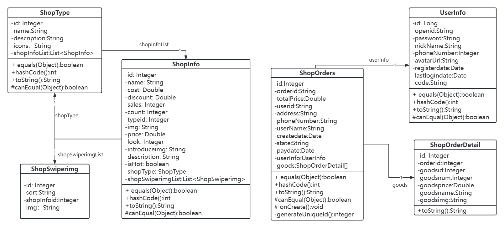{width="6.100694444444445in"
height="2.763888888888889in"}

图4-1助农东西山微信小程序类图

## 第4.3节 系统核心功能模块设计

### **4.3.1 用户登录模块**

该模块的主要功能是用户进行授权登录。用户在点击"我的"页面或进行农产品购买或认养时，触发微信授权登录流程。系统引导用户进行微信授权，获取用户的微信基本信息，如昵称和头像，确保用户身份安全合法，以便进行后续操作。用户的授权登录流程图如{{fig:登录流程图}}所示。

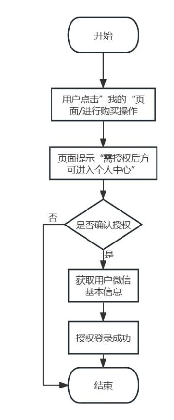{width="1.3152777777777778in"
height="3.9368055555555554in"}

图4-2用户授权登录流程图

### **4.3.2 农产品购买模块**

该模块的主要功能是浏览、选择、购买农产品，并完成支付流程。加入购物车或立即购买前用户需进行授权登录，方可进行后续操作。用户的农产品购买流程图如{{fig:购买流程图}}所示。

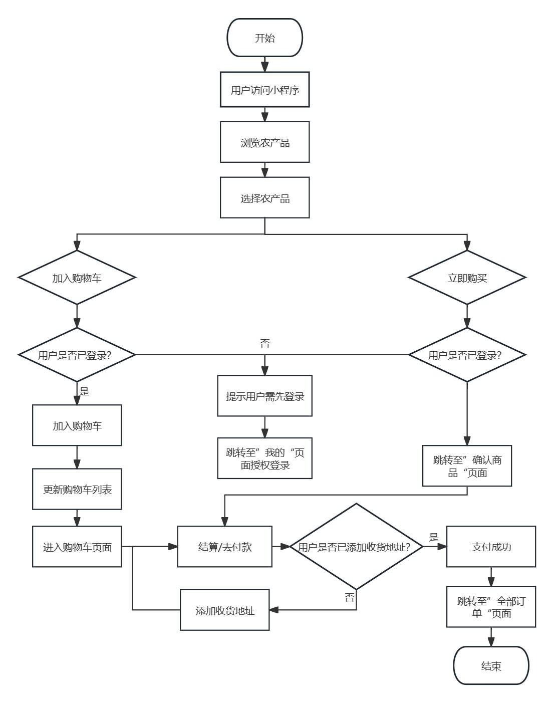{width="5.459722222222222in"
height="6.925694444444445in"}

图4-3用户农产品购买流程图

### **4.3.3 农产品搜索模块**

该模块的主要功能是用户通过搜索栏快速查找心仪的农产品。输入农产品名称后，小程序立即启动模糊查询，筛选出匹配的农产品并展示给用户。用户点击展示的农产品名称即可跳转到详情页面，查看更多信息。用户的农产品搜索流程图如{{fig:搜索流程图}}所示。

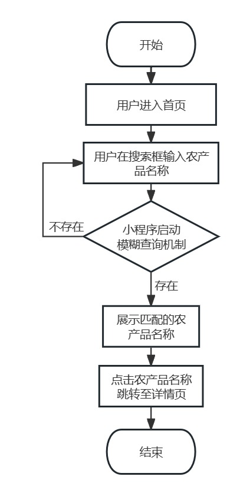{width="1.9277777777777778in"
height="4.395138888888889in"}

图4-4用户搜索商品流程图

## 第4.4节 数据库设计

### **4.4.1 数据库概念设计**

分析了系统的需求，各个功能模块以及相关图后，设计了本系统的数据库概念结构模型如下{{fig:E-R图}}所示。

{width="5.772916666666666in"
height="2.5388888888888888in"}

图4-5数据库E-R图

### **4.4.2 数据库逻辑设计**

根据系统的E-R图，设计出本系统的关系数据模型。

（1）用户：id（自增主键），用户账号，用户密码，用户昵称，电话号码，用户头像，注册日期，最近登录日期。

（2）农产品：id（自增主键），农产品名称，农产品描述，农产品价格，农产品库存，农产品类别id，农产品详情图片，农产品是否热卖。

（3）订单：id（自增主键），订单号，订单总价，用户账户，地址，电话号码，收件人姓名，创建时间，订单订单状态，订单支付时间。

（4）订单详情：id（自增主键），订单id，农产品id，农产品数量，农产品价格，农产品名称，农产品图片。

### **4.4.3 数据库表设计**

根据平台中需要建立多张数据库表，根据4.4.1节设计的E-R图以及4.4.2节设计的关系数据模型，本系统主要包括用户表，农产品信息表，订单表，订单详情表，下面是各表详情。

（1）用户表如 {{tbl:用户表（user_info）}} 所示。

表4-1 用户表（user_info）

Table: 用户表（user_info）
| 字段名 | 数据类型 | 描述  |
| --- | --- | --- |
| id  | bigint() | 主键  |
| openid | varchar(255) | 用户账号 |
| password | varchar(255) | 用户密码 |
| nickName | varchar(255) | 用户昵称 |
| phoneNumber | varchar(255) | 电话号码 |
| avatarUrl | varchar(255) | 用户头像 |
| registerDate | datetime() | 注册时间 |
| lastLoginDate | datetime() | 最近登录时间 |


（2）农产品信息表如 {{tbl:农产品信息表（shop_info）}} 所示。

表4-2 农产品信息表（shop_info）

Table: 农产品信息表（shop_info）
| 字段名 | 数据类型 | 描述  |
| --- | --- | --- |
| id  | int() | 主键  |
| name | varchar(255) | 农产品名称 |
| description | text() | 农产品描述 |
| cost | double(10) | 农产品价格 |
| count | int() | 农产品库存 |
| typeId | int() | 农产品类别id |
| img | varchar(255) | 农产品图片 |
| introduceImg | varchar(255) | 农产品详情图片 |
| isHot | bit(1) | 农产品是否热卖 |


（3）订单表如 {{tbl:订单表（shop_orders）}} 所示。

表4-3 订单表（shop_orders）

Table: 订单表（shop_orders）
| 字段名 | 数据类型 | 描述  |
| --- | --- | --- |
| id  | int() | 主键  |
| orderId | varchar(255) | 订单号 |
| totalPrice | double(10) | 订单总价 |
| userId | varchar(255) | 用户账号 |
| address | varchar(255) | 地址  |
| phoneNumber | varchar(255) | 电话号码 |
| userName | varchar(255) | 收件人姓名 |
| createDate | datetime() | 订单创建时间 |
| state | varchar(255) | 订单状态 |
| payDate | datetime() | 订单支付时间 |


（4）订单表如 {{tbl:订单表（shop_order_detail）}} 所示。

表4-4 订单表（shop_order_detail）

Table: 订单表（shop_order_detail）
| 字段名 | 数据类型 | 描述  |
| --- | --- | --- |
| id  | int() | 主键  |
| orderId | int() | 订单id |
| goodsId | int() | 农产品id |
| goodsNum | int() | 农产品数量 |
| goodsPrice | double(10) | 农产品价格 |
| goodsName | varchar(255) | 农产品名称 |
| goodsImg | varchar(255) | 农产品图片 |


## 第4.5节 本章小结

本章主要是系统的详细设计的介绍，包括系统的包图的设计以及数据库设计，是为下一章系统的实现做准备。

# **第5章 系统实现**

## 第5.1节 项目系统层次设计

助农东西山微信小程序的项目层次结构如{{fig:项目层次结构}}所示。

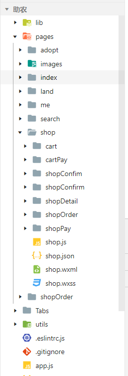{width="1.5819444444444444in"
height="4.642361111111111in"}

图5-1 项目层次

## 第5.2节 系统核心功能实现

### **5.2.1 农产品购买模块**

用户通过农产品展示功能选择心仪的商品，加入购物车后轻松管理数量及操作，最终确认购买并生成订单。订单管理功能使用户随时查看和管理订单状态。

1.  用户在农产品商城页面浏览选择商品，顶部展示不同农产品分类，用户可点击所需分类快速选购。农产品展示效果如{{fig:展示效果}}所示。

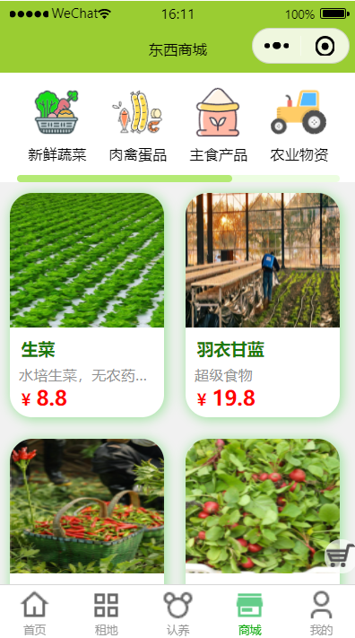{width="1.7534722222222223in"
height="3.1493055555555554in"}

图5-2 农产品展示效果图

点击菜单项后，函数提取索引值index，从Cates数组或对象中取出对应的shopInfoList，然后通过setData方法更新页面数据，将currentIndex设置为菜单项的索引，shopContentList更新为新的信息列表，触发视图层重新渲染，显示用户选择的内容。商城分类功能页面实现代码如{{lst:前端代码图}}所示。

```{caption="前端代码图"}
    handleMenuItemChange(e){
      const {index} = e.currentTarget.dataset;
      let shopContentList = this.Cates[index].shopInfoList
      console.log("shopContentList",shopContentList)
      this.setData({
        currentIndex:index,
        shopContentList})},

```

图5-3 商城分类功能前端代码图

通过shopTypeService.list(\...)方法获取所有商店类型列表，使用QueryWrapper\<ShopType\>()构建查询条件包装器。将查询结果存储到shopTypeList变量中，并创建一个HashMap对象map，将shopTypeList以"message"为键存入map中。最后，通过R.ok(map)方法返回成功的响应对象，使小程序端能够接收到包含所有商店类型列表的响应。后端实现代码如{{lst:后端代码图}}所示。

```{caption="后端代码图"}
@GetMapping("/findShopType")
public R findShopType(){
        List<ShopType> shopTypeList = shopTypeService.list(new QueryWrapper<ShopType>().orderByAsc("id"));
        Map<String,Object> map=new HashMap<>();
        map.put("message",shopTypeList);
        return R.ok(map);}
```

图5-4 获取商城类型后端代码图

2.  用户浏览商品后选择农产品进入详情页面，查看更多信息。用户可在详情页点击加入购物车或立即下单按钮进行下一步操作。农产品详情页及加入购物车成功如{{fig:加入购物车成功提示}}所示。（演示为已登录状态下的操作）

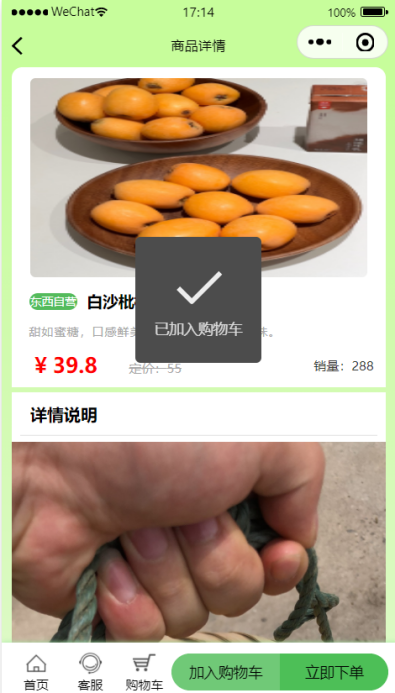{width="1.79375in"
height="3.1493055555555554in"}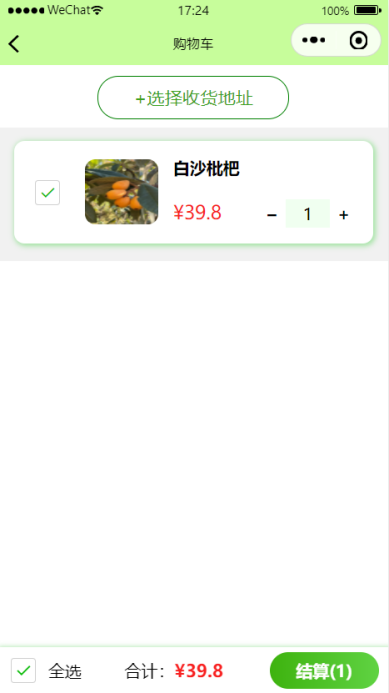{width="1.7694444444444444in"
height="3.1493055555555554in"}

图5-5 加入购物车成功效果图

首先，尝试从缓存中获取当前购物车数据，如果缓存中没有数据，则默认购物车为空数组。然后，它检查购物车数组中是否已经存在与当前商品（this.productInfo）相同
id
的商品。如果存在，则会找到对应商品的索引，并增加该商品的数量；如果不存在，则会将当前商品信息（包括默认数量1和默认选中状态checked为true）添加到购物车数组中。最后，使用wx.setStorageSync(\'cart\',cart)
将更新后的购物车数据重新保存到缓存中。加入购物车功能实现代码如{{lst:加入购物车功能前端代码图}} 所示。

```{caption="加入购物车功能前端代码图"}
setCartAdd() {
    let cart = wx.getStorageSync('cart') || [];
    console.log("cart=" + cart);//购物车里存在相同数据 直接增加数量，不存在则单独加一条信息
    let index = cart.findIndex(v => v.id == this.productInfo.id);
    if (index == -1) {//购物车里不存在当前商品
      this.productInfo.num = 1;
      this.productInfo.checked = true;//默认商品是选中的
      cart.push(this.productInfo);
    } else {//已经存在
      cart[index].num++;
    }
    wx.setStorageSync('cart', cart);//把购物车加到缓存中
  },

```

图5-6 加入购物车功能前端代码图

（3）用户可以选择多个商品加入购物车，购物车会根据用户所勾选的商品价格、数量得出总价。用户点击结算按钮，系统会先判断用户是否已经选择收获地址，对未选择的用户做出相应提示。购物车功能页如{{fig:购物车提示收货地址}}所示。

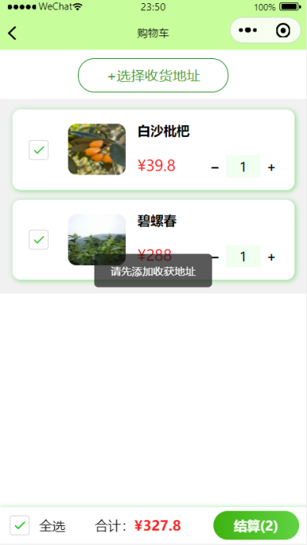{width="1.7743055555555556in"
height="3.1493055555555554in"}

图5-7 购物车功能页效果图

首先，定义了三个变量allChecked、totalPrice和totalNum，分别表示全选状态、总价和商品总数量。然后，遍历购物车数据cart，对于每个已选择的商品，将其数量和价格累加到totalNum和totalPrice。如果有未选中的商品，则将allChecked设为false。同时，如果购物车为空，也将allChecked设为false。更新页面数据后，使用wx.setStorageSync将购物车数据保存到本地缓存。购物车结算功能实现代码如{{lst:购物车结算}}所示。

```{caption="购物车结算"}
setCart(cart){
      let allChecked=true;//默认全选
      let totalPrice=0;
      let totalNum=0;
      //如果有数据全选，为空不选择
      cart.forEach(v=>{
        if(v.checked){
          totalNum+=v.num;
          totalPrice+=v.cost*v.num;//商品价格乘以数量
        }
else{
allChecked=false;
}
})
allChecked=cart.length!=0?allChecked:false;
totalPrice = totalPrice.toFixed(2); // 将 totalPrice 保留两位小数
this.setData({
cart,
allChecked,
totalNum,
totalPrice: parseFloat(totalPrice) // 将字符串转换为数值类型
})

//cart设置到缓存中,当前进行的操作在下次进入小程序会保存下来
wx.setStorageSync('cart', cart);
}

```

图5-8 购物车结算功能前端代码图

3.  用户选择好收货地址点击结算后跳转至确认订单页面，页面显示收货地址、所选购的商品信息等。确认订单页面如{{fig:确认订单}}所示。

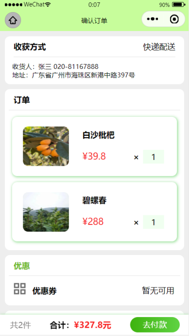{width="1.7715277777777778in"
height="3.15in"}

图5-9 确认订单页面效果图

首先，通过wx.getStorageSync方法获取用户的收货地址和购物车数据（cart）。如果购物车数据不存在，则初始化为空数组。然后，过滤购物车数据，只保留用户已选中的商品，并累加它们的数量和总价。最后，使用this.setData方法更新页面数据，包括购物车信息、收货地址、商品总数量和总价。获取订单页面详情功能实现代码如{{lst:获取订单前端}}所示。

```{caption="获取订单前端"}
    onShow() {
      let address=wx.getStorageSync('address');
      let cart=wx.getStorageSync('cart')||[];
      cart=cart.filter(v=>v.checked)
      let totalPrice=0;
      let totalNum=0;
      cart.forEach(v=>{
          totalNum+=v.num;
          totalPrice+=v.cost*v.num;//商品价格乘以数量})
      totalPrice = totalPrice.toFixed(2); // 将 totalPrice 保留两位小数
      this.setData({
        cart,address,totalNum, totalPrice: parseFloat(totalPrice) // 将字符串转换为数值类型
      })},

```

图5-10 获取订单页面详情前端代码图

（4）用户确认订单信息无误后，点击去付款，是否支付成功会做出相应提示，若支付成功会在2s后跳转到我的订单页面。支付成功提示页面及跳转至我的订单页面如 {{fig:支付成功}}所示。

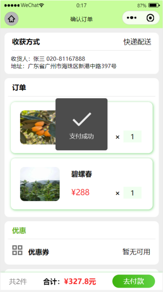{width="1.5180555555555555in"
height="2.716666666666667in"}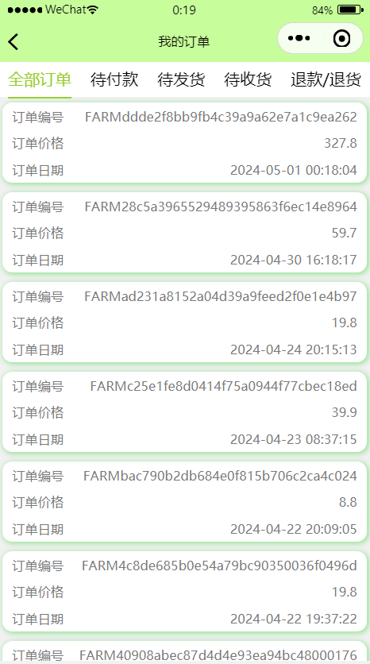{width="1.5131944444444445in"
height="2.716666666666667in"}

图5-11 支付成功提示页面及跳转至我的订单页面效果图

函数首先从页面数据中提取订单所需信息，包括总价、地址、用户名、电话号码和购物车商品信息，存入orderParam对象。然后发送POST请求到后端接口/my/order/create创建订单。若订单创建成功，更新本地购物车数据并提示支付成功，然后自动跳转到订单页面。若发生错误，显示支付失败提示框，建议用户稍后重试。支付并创建订单功能是的代码如{{lst:创建订单}}所示。

```{caption="创建订单"}
async createOrder(){
    try{
      const totalPrice=this.data.totalPrice;
      const address=this.data.address.provinceName+this.data.address.cityName+this.data.address.countyName+this.data.address.detailInfo;
      const userName=this.data.address.userName;
      const phoneNumber=this.data.address.telNumber;
      let goods=[];
      this.data.cart.forEach(v=>goods.push({
        goodsid:v.id,
        goodsnum:v.num,
        goodsprice:v.cost,
        goodsname:v.name,
        goodsimg:v.img
      }))
const orderParam=({
        totalPrice,
        address,
        userName,
        phoneNumber,
        goods
      })
      const res=await requestutil({url:"/my/order/create",method:"POST",data:orderParam});
//删除缓存中已经支付的商品
      let newCart=wx.getStorageSync('cart');
      newCart=newCart.filter(v=>!v.checked);
      //未选中商品集合存入缓存
      wx.setStorageSync('cart', newCart);
      wx.showToast({
        title: '支付成功',
        duration: 2000, // 设置 Toast 显示时间为 2s
        success: function() {
          // 使用 setTimeout 函数延迟跳转操作
          setTimeout(function() {
            // 跳转到新页面
            wx.navigateTo({
              url: '../shopOrder/shopOrder?type=0',
            });, 2000); // 设置延迟时间为 2s，与 Toast 显示时间保持一致}})
    }catch(error){
      console.log(error);
      wx.showToast({
        title: '支付失败，请稍后重试',})}}
```

图5-12 支付并创建订单功能前端代码图

在系统中创建新的订单。具体实现过程如下：

使用@RequestMapping("/create")注解定义URL路径，并在@Transactional注解下执行整个操作，保证数据一致性。create方法接收ShopOrders对象和token作为参数。通过token获取用户的openid，并验证JWT令牌。验证成功后，提取openid设置为shopOrders对象的userid属性。生成唯一订单号，设置创建日期。保存订单至数据库并获取订单ID。遍历商品列表，为每个商品设置订单号并保存至数据库。最后，返回包含订单号的成功响应给小程序端。后端实现代码如图5-13所示。

图5-13 创建订单功能后端代码图

### **5.2.2 农产品搜索模块**

用户点击首页上方的搜索框进入东西搜索页面，在搜索框中输入想要的产品名称，搜索栏下方会显示对应名称的产品，点击该产品名称即可进入产品详情页。搜索页面如{{fig:首页搜索}}所示。

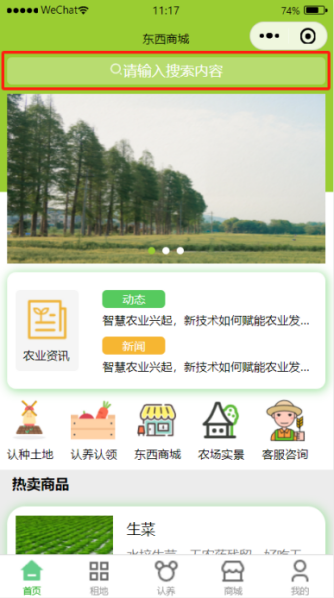{width="1.51875in"
height="2.716666666666667in"}{width="1.5340277777777778in"
height="2.716666666666667in"}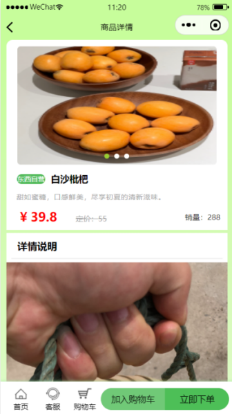{width="1.5284722222222222in"
height="2.716666666666667in"}

图5-14搜索页面效果图

用户输入文本时，若为空，清空两个列表并将isFocus设为false；若不为空，设置isFocus为true，并启动定时器延迟搜索。定时器在1秒后执行search方法，若期间有新输入，则清除之前的定时器并重新设定。search方法使用Promise.all同时向两个API发送搜索请求，将结果分别设置为shopInfoList和adoptInfoList。搜索实现代码如{{lst:搜索实现代码}} 所示。

```{caption="搜索实现代码"}
handleInput(e){
      const {value}=e.detail;
      if(!value.trim()){//假如值为空
        this.setData({
          shopInfoList:[],//赋空
          adoptInfoList:[],
          isFocus:false
        })
        return;
      }
      this.setData({
        isFocus:true
      })
      //1s搜索一次并清除缓存
      clearTimeout(this.TimeOutId);
      this.TimeOutId=setTimeout(()=>{
        this.search(value);
      },1000)},
async search(q) {
  const [shopResult, adoptResult] = await Promise.all([
    requestutil({
      url: '/shopInfo/search',
      data: { q }
    }),
    requestutil({
      url: '/adoptInfo/search',
      data: { q }
    })
  ]);
  this.setData({
    shopInfoList: shopResult.data.message,
    adoptInfoList: adoptResult.data.message
  });
},


```

图5-15 搜索功能前端代码图

## 第5.3节 本章小结

本章主要介绍了助农东西山微信小程序的项目层次结构和一些核心功能实现过程以及实现方法。

# 6.  **系统测试**

## 第6.1节 功能性测试

### **6.1.1 用户授权登录功能测试**

用户授权登录点击确定后获取用户信息并显示在我的页面上，用户授权登录实现如{{fig:登录功能测试}}所示。用户授权登录测试表如{{fig:登录}}所示。

表6-1 用户授权登录功能测试

{width="6.236111111111111in"
height="2.7444444444444445in"}

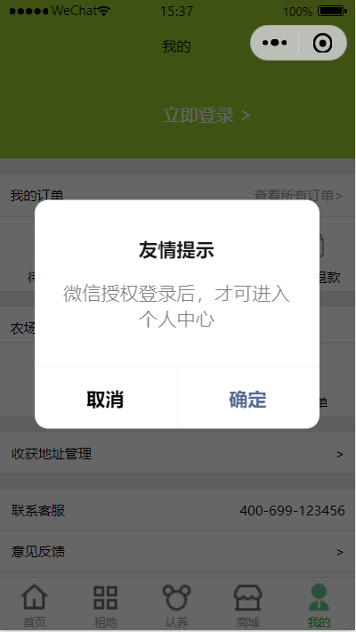{width="1.773611111111111in"
height="3.1493055555555554in"}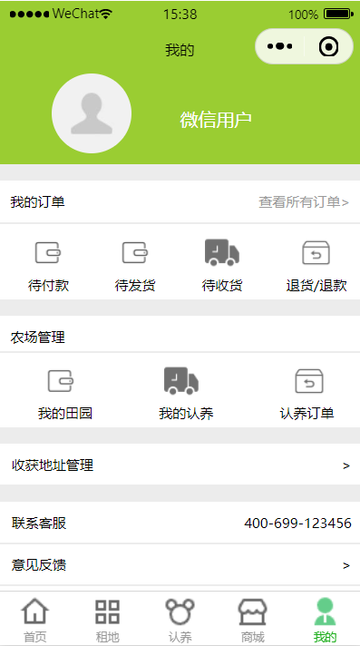{width="1.7541666666666667in"
height="3.1493055555555554in"}

图6-1 用户授权登录效果图

### **6.1.2 农产品搜索功能测试**

用户在首页搜索框内对农产品进行搜索。农产品搜索功能测试表如表6-2所示。

表6-2 农产品搜索功能测试

{width="6.375in" height="1.176388888888889in"}

### **6.1.3 农产品认养功能测试**

用户在浏览可认养的农产品后，选择自己想要认养的产品进行认养。农产品认养功能测试表如表6-3所示。实现图如图6-2所示。

表6-3 农产品认养功能测试

{width="6.002083333333333in"
height="4.371527777777778in"}

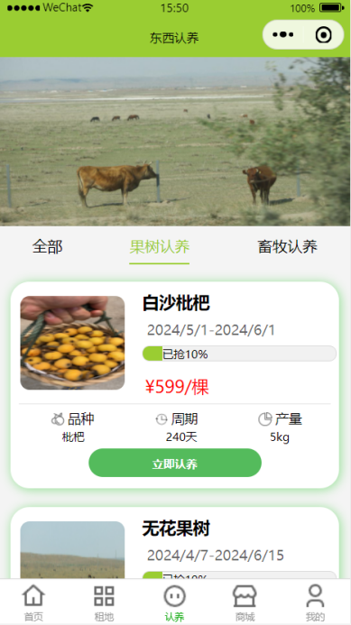{width="1.7673611111111112in"
height="3.1493055555555554in"}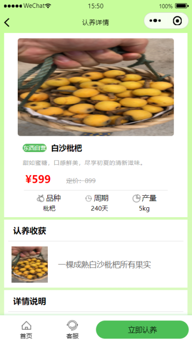{width="1.7680555555555555in"
height="3.1493055555555554in"}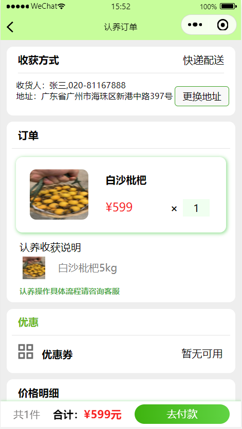{width="1.7743055555555556in"
height="3.1493055555555554in"}

图6-2 农产品认养效果图

### **6.1.4 农产品购买功能测试**

农产品购买有两种形式，加入购物车后点击结算或在产品详情页直接点击下单。农产品购买功能测试表如表6-4所示。

表6-4 农产品购买

{width="6.404166666666667in"
height="1.8944444444444444in"}

### **6.1.5 订单管理功能测试**

用户成功购买/认养农产品后会生成相应的订单，除支付成功会自动跳转至我的订单页面外还可以进入"我的"页面进行查看，能够点击不同的订单状态查看不同的订单。订单管理功能测试表如表6-5所示。订单管理实现图如{{fig:订单管理功能测试}}所示。

表6-5 订单管理功能测试

{width="6.007638888888889in"
height="3.292361111111111in"}

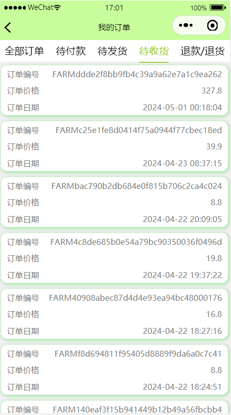{width="1.7527777777777778in"
height="3.1493055555555554in"}

图6-3 订单管理效果图

## 第6.2节 本章小结

本章简单介绍了对助农东西微信小程序的功能性测试，主要针对授权登录、农产品购买、搜索、认养和订单管理模块。

# 7.  **总结与展望**

## 第7.1节 总结

通过查阅相关文献资料，我了解到微信小程序在现代农业电子商务领域中的重要作用，以及如何通过技术创新提升农产品销售效率和用户体验。通过市场调研和需求分析，我明确了系统的核心功能，并采用了Spring
Boot框架、MyBatis持久层框架以及MySQL数据库管理系统，完成了系统的设计和实现。在此对本次毕业设计与论文的主要工作进行总结。

在开发过程中，通过深入分析用户需求设计了用户端的功能模块。用户访问小程序后能够浏览并选购心仪的农产品。小程序支持农产品展示、详细信息查看、加入购物车、下单购买、支付等功能。在技术上，采用了微信小程序的原生框架进行开发。原生框架提供了丰富的API和组件，使得能够快速构建出功能完善、界面美观的小程序。同时结合后端服务，实现了用户授权登录、订单管理、支付等功能，确保用户数据的安全性和可靠性。在数据库的选择上，采用了MySQL作为数据库管理系统。同时还对系统进行了严格的测试和评估，确保各项功能稳定运行，并满足用户的基本需求。

助农东西山微信小程序为农产品销售开辟了新渠道，提供了便捷、个性化的购物体验。消费者可随时随地浏览、购买农产品，并享受快速、准确的配送服务。随着技术不断进步和市场发展，该小程序将继续在农业电商领域发挥重要作用，为农业生产和农村经济发展做出更大贡献。

## 第7.2节 展望

通过大学期间所学的基本知识，助农东西山微信小程序系统功能模块基本已经实现，但是由于自己的知识水平有限，所以系统有许多不足之处，需要进一步的完善。

（1）功能不够完善。目前的功能主要集中在基本的农产品展示和购买，缺少智能推荐和个性化定制等提升用户体验的功能。

（2）商品信息不全。缺少农产品的详细介绍，如生长环境、种植方式、营养价值等重要信息，影响用户购买决策。

（3）个性化推荐缺失。根据用户的购买历史和偏好进行智能推荐，导致用户需要自行搜索和筛选商品，降低购物效率。

（4）缺乏用户交流功能。缺少用户评价、晒单、问答等社区功能，降低了用户参与度和黏性。

（5）售后服务不完善。退换货流程不清晰和便捷，用户遇到问题时难以得到及时解决。

# 参考文献 


::: {#refs}
:::


# 致  谢

正文正文正文正文正文正文正文正文正文正文正文正文

# 附  录

正文正文正文正文正文正文正文正文正文正文正文正文


